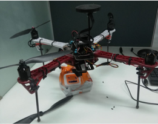

## hello 👋
# hi
<picture>
  <source media="(prefers-color-scheme: dark)" srcset="https://user-images.githubusercontent.com/25423296/163456776-7f95b81a-f1ed-45f7-b7ab-8fa810d529fa.png">
  <source media="(prefers-color-scheme: light)" srcset="https://user-images.githubusercontent.com/25423296/163456779-a8556205-d0a5-45e2-ac17-42d089e3c3f8.png">
  
</picture>

# this is zaid

# "ATOM ROBOTICS" SPECIAL TEAM FOR ROBOTICS VIT CHENNAI 

# Our Projects
 ### **❗❗ the names of the project are linked with a hyper-text that leads you to the project repositories❗❗**
 
## - 🚁 DRONES
#### [EYANTRA-19](https://github.com/atomrobotics/EYANTRA-19) , PID based autonomous drone navigation " ROSpy based control system for a quadcopter to transverse  autonomously"
<picture>
 <source media="(prefers-color-scheme: dark)" srcset="images/archer2drone.PNG">
 <source media="(prefers-color-scheme: light)" srcset="images/archer2drone.PNG">
 
</picture>
#### [ARDUINO SIMULATOR FOR DRONE](https://github.com/JustTheCoolest/Atom_Arduino_Drone_Simulator) ,  simulates the programming environment for what would be the drone's onboard computer

## - ✈ Airplane
#### [IPAS-21](https://github.com/atomrobotics/IPAS-21) , The project was developed for "International Planetary Aerial Systems" Challenge

## - 🏎 LINE FOLLOWER
#### [ROCINATE](https://github.com/JustTheCoolest/Atom-Rocinante-Line-Follower) , AWARD WINNING ROBOT TechnoXian World Robotics Championship
#### [QUARKS-V1](https://github.com/atomroboticsvitc/line_follower_quarks_v1) , robot based on the Arduino Nano greyrobotics lfs-6 IR sensor array DRV8833 motor driver N20 dc motors AMS1117 3.3v voltage regulator
#### [TECHNOXIAN-2023](https://github.com/atomroboticsvitc/LineFollower_Technoxian2023) , robot based on the SmartElex RL508 8-channel sensor array

## - 🚘 RC wire-less terrain vehicle

## - 🚘 ROBOSOCCER
### Intelligent Ground Vehicles (IGV): Autonomous vehicles designed for the Intelligent Ground Vehicle Competition (IGVC).

### MR Robot: ModulaR Robot: An autonomous navigation robot capable of MOVING IN SPACES BY AVOIDING OBSTACLES . 

### [Autonomous Unmanned Aerial Vehicle](https://github.com/atomrobotics/IPAS-21) :  An autonomous navigation path planning for aeriel vehicles like drones

### Other Projects: [Code Snippets](https://github.com/atomrobotics/Code_Snippets)  the project includes path planning algorithms, 200+ bird species detection, object detection using imageai, number plate detection, segmentation, etc.,

# OUR SOCIAL MEDIA PLATFORMS
### [linkedin](https://www.linkedin.com/company/atomrobotics/) , [website](https://atomrobotics.github.io/robots.html) , [youtube](https://www.youtube.com/@atomrobotics2167) , [instagram](https://www.instagram.com/atomrobotics_vitc?igsh=OGl1eWRrYmZrcG5k) 

# Technologies We Use 
## Our projects utilize a wide range of open-source technologies, including:

### **ROS & ROS 2**: Robot Operating System frameworks for building robot applications.
### **Gazebo**: A simulation tool for testing robot designs. 
### **Fusion 360,solidworks and Ansys**: A comprehensive CAD tool for designing mechanical components. 
### **Python/C++**: Primary programming languages for our software development. 
### **Easy Eda & Altium**: Tools for designing PCB'S

#  **OUR VICTORIES**

### Winner of Autonomous Line follower, CURRENTS'20 @ NIT Trichy.
### Winner of RoboZest, KURUKSHETRA'20 @ CEG, Anna University.
### Winner of Autonomous Line follower Vashisht 2019 @ IIITDM Kanchipuram.
### Winner of Autonomous Line follower PISTOBOLTZ'20 @ MIT, Chromepet.
### First runner up of Line follower @ Chennai International Youth Fest
## **MANY MORE VICTORIES**
